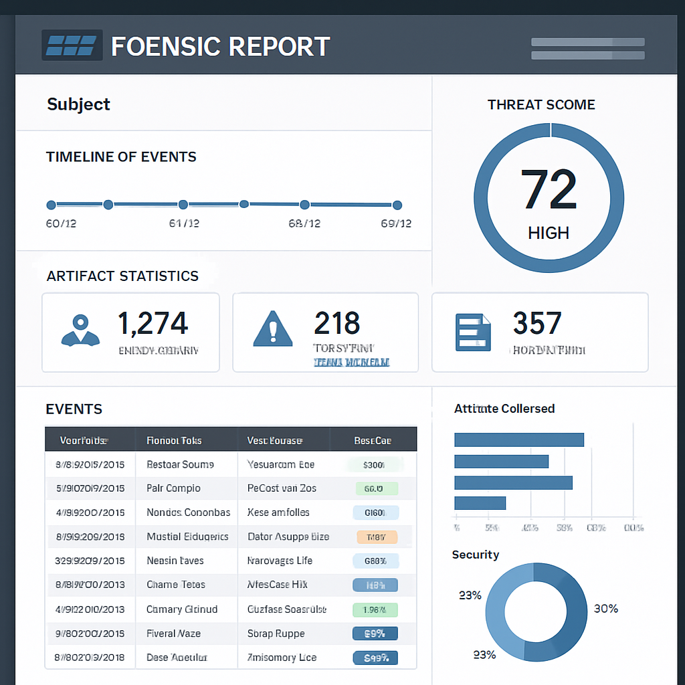

<div align="center">
  
  <h1>ForensicHunter</h1>
  <p>L'outil de forensic Windows open source de référence</p>
  
  <p>
    <a href="#fonctionnalités"></a>
    <a href="#installation"></a>
    <a href="#licence"></a>
    <a href="#compatibilité"></a>
    <a href="#compatibilité"></a>
    <a href="#sécurité"></a>
    <a href="#multiplateforme"></a>
    <a href="#documentation"></a>
  </p>
</div>

## 🔍 Présentation

**ForensicHunter** est un outil professionnel de forensic pour Windows qui permet de collecter l'intégralité des preuves numériques sur un système, tout en garantissant leur intégrité pour une recevabilité en justice. Conçu avec une approche DevSecOps, il surpasse les outils existants comme Velociraptor, KAPE ou FTK Imager en termes de complétude, de rapidité et d'intelligence.

ForensicHunter offre une architecture modulaire permettant l'ajout de nouveaux modules via un système de plugins, et produit des rapports exploitables automatiquement dans différents formats (HTML, JSON, CSV).

## ✨ Fonctionnalités

### Collecte complète de preuves numériques

- **Journaux d'événements (Event Logs)** - Collecte et analyse de tous les journaux d'événements Windows
- **Fichiers de registre (Registry hives)** - Extraction et analyse des ruches de registre
- **Fichiers temporaires et artefacts d'usage** - Identification et collecte des fichiers temporaires et artefacts système
- **Historique des navigateurs** - Analyse de l'historique Edge, Chrome et Firefox
- **Processus et connexions réseau** - Capture des processus en cours et des connexions réseau actives
- **Périphériques USB** - Détection et analyse des périphériques USB connectés
- **Capture mémoire (RAM dump)** - Acquisition de la mémoire vive pour analyse
- **Données utilisateur** - Collecte des fichiers récents, téléchargements et autres données utilisateur

### Intégrité des preuves garantie

- **Calcul de hashes** - MD5, SHA-1, SHA-256 pour chaque artefact collecté
- **Chaîne de custody documentée** - Traçabilité complète de la collecte à l'analyse
- **Mode lecture seule** - Aucune modification des preuves originales
- **Journal d'audit détaillé** - Enregistrement de toutes les opérations effectuées
- **Intégration blockchain** - Stockage immuable des hashes de preuves pour garantir l'intégrité

### Analyse avancée

- **Détection d'anomalies** - Identification automatique des comportements suspects
- **Scoring de preuves** - Évaluation de la pertinence des preuves collectées
- **Intelligence artificielle** - Analyse automatisée et reconstruction d'incidents
- **Corrélation d'événements** - Mise en relation des différents artefacts
- **Analyse comportementale** - Détection de comportements malveillants
- **Intégration SIEM** - Connexion avec les principaux SIEM du marché

### Rapports professionnels

- **Rapports HTML interactifs** - Visualisation claire et interactive des résultats
- **Exportation JSON/CSV** - Données structurées pour analyse ultérieure
- **Visualisations avancées** - Graphiques, chronologies et cartographies
- **Rapports juridiques** - Formats adaptés aux procédures judiciaires

## 🖥️ Interface

ForensicHunter propose deux interfaces :

- **Interface CLI professionnelle** - Pour une utilisation en ligne de commande
- **Interface graphique (GUI)** - Pour une utilisation simplifiée et visuelle

<div align="center">
  
</div>

## 📋 Compatibilité

ForensicHunter est compatible avec :

- **Windows** : XP, Vista, 7, 8, 8.1, 10, 11
- **Windows Server** : 2003, 2008, 2012, 2016, 2019, 2022
- **Multiplateforme** : Modules d'analyse disponibles pour Linux et macOS

## 🔒 Sécurité (DevSecOps)

ForensicHunter a été développé selon les principes DevSecOps :

- **Validation stricte des entrées** - Protection contre les injections
- **Gestion sécurisée des privilèges** - Principe du moindre privilège
- **Chiffrement des données sensibles** - Protection des informations confidentielles
- **Protection contre les élévations de privilèges** - Contrôle strict des permissions
- **Vérification d'intégrité** - Contrôle de l'intégrité du code et des binaires
- **Sandboxing** - Isolation des opérations à risque

Un audit de sécurité complet a été réalisé et est disponible dans `docs/security_audit.md`.

## 🚀 Installation

### Prérequis

- Windows 7 ou supérieur (Windows 10/11 recommandé)
- Python 3.8 ou supérieur
- 4 Go de RAM minimum (8 Go recommandés)
- 1 Go d'espace disque disponible

### Installation automatique

1. Téléchargez la dernière version de ForensicHunter
2. Exécutez le script d'installation :

```batch
install.bat
```

### Installation manuelle

1. Clonez le dépôt :

```bash
git clone https://github.com/servais1983/ForensicHunter.git
```

2. Installez les dépendances :

```bash
cd ForensicHunter
pip install -r requirements.txt
```

## 🔧 Utilisation

### Collecte complète

```bash
python src/forensichunter.py --full-scan --output C:\ForensicHunter\Results
```

### Collecte ciblée

```bash
python src/forensichunter.py --collect event_logs registry browser_history --output C:\ForensicHunter\Results
```

### Interface graphique

```bash
python src/gui/main_gui.py
```

### Analyse à distance

```bash
python src/forensichunter.py --remote-analyze --target 192.168.1.10 --credentials admin:password
```

## 🧩 Architecture modulaire

ForensicHunter est construit sur une architecture modulaire qui permet d'étendre facilement ses fonctionnalités :

```
ForensicHunter/
├── src/                    # Code source principal
│   ├── collectors/         # Modules de collecte d'artefacts
│   ├── analyzers/          # Modules d'analyse et de détection
│   │   ├── memory/         # Analyse de mémoire avec Volatility
│   │   ├── virustotal/     # Intégration VirusTotal
│   │   ├── ai/             # Analyse par intelligence artificielle
│   ├── reporters/          # Générateurs de rapports
│   ├── gui/                # Interface graphique
│   ├── cloud/              # Analyse des environnements cloud
│   ├── siem/               # Intégration SIEM
│   ├── multiplatform/      # Support multiplateforme
│   ├── behavioral/         # Analyse comportementale
│   ├── remote/             # Analyse à distance
│   ├── blockchain/         # Intégration blockchain
│   ├── plugins/            # Système de plugins
│   └── utils/              # Utilitaires communs
│       ├── integrity/      # Outils d'intégrité des preuves
│       └── security/       # Outils de sécurité
├── rules/                  # Règles YARA et IOCs
├── templates/              # Templates pour les rapports
├── static/                 # Ressources statiques
├── docs/                   # Documentation complète
├── install.bat             # Script d'installation Windows
├── requirements.txt        # Dépendances Python
└── README.md               # Documentation principale
```

## 📊 Comparaison avec les outils existants

| Fonctionnalité | ForensicHunter | Velociraptor | KAPE | FTK Imager |
|----------------|----------------|--------------|------|------------|
| Collecte complète | ✅ | ✅ | ⚠️ | ⚠️ |
| Intégrité des preuves | ✅ | ⚠️ | ⚠️ | ✅ |
| Analyse IA | ✅ | ❌ | ❌ | ❌ |
| Détection d'anomalies | ✅ | ⚠️ | ❌ | ❌ |
| Multiplateforme | ✅ | ✅ | ❌ | ⚠️ |
| Analyse à distance | ✅ | ✅ | ❌ | ❌ |
| Intégration blockchain | ✅ | ❌ | ❌ | ❌ |
| Interface graphique | ✅ | ✅ | ❌ | ✅ |
| Open source | ✅ | ✅ | ❌ | ❌ |
| Compatibilité Windows | XP-11 | 7-11 | 7-10 | XP-10 |

## 🗺️ Roadmap

### Phase 1 (Complétée)
- ✅ Collecte complète des preuves numériques
- ✅ Intégrité des preuves garantie
- ✅ Architecture modulaire avec système de plugins
- ✅ Rapports exploitables (HTML, JSON, CSV)
- ✅ Interface CLI professionnelle

### Phase 2 (Complétée)
- ✅ Interface graphique (GUI)
- ✅ Analyse des environnements cloud (AWS, Azure, GCP)
- ✅ Intégration SIEM (Splunk, ELK, QRadar)
- ✅ Support multiplateforme (Windows, Linux, macOS)
- ✅ Analyse comportementale avancée

### Phase 3 (Complétée)
- ✅ Intelligence artificielle pour l'analyse
- ✅ Analyse à distance
- ✅ Intégration blockchain pour l'intégrité des preuves
- ✅ Corrélation multi-sources
- ✅ Visualisations avancées

### Phase 4 (Prochaine)
- 🔄 Analyse temps réel et surveillance continue
- 🔄 Détection de menaces avancées (APT)
- 🔄 Intégration avec les solutions EDR
- 🔄 Analyse forensique de conteneurs et environnements virtualisés
- 🔄 Marketplace de plugins communautaires

## 📚 Documentation

Une documentation complète est disponible dans le dossier `docs/` :

- [Manuel utilisateur](docs/user_manual.md)
- [Guide du développeur](docs/developer_guide.md)
- [Audit de sécurité](docs/security_audit.md)

## 🤝 Contribution

Les contributions sont les bienvenues ! Consultez le [guide de contribution](docs/CONTRIBUTING.md) pour plus d'informations.

## 📄 Licence

Ce projet est sous licence MIT. Voir le fichier [LICENSE](LICENSE) pour plus de détails.

## 📞 Contact

Pour toute question ou suggestion, n'hésitez pas à ouvrir une issue sur GitHub.

---

<div align="center">
  <p>ForensicHunter - L'outil de forensic Windows open source de référence</p>
  <p>Développé avec ❤️ pour la communauté forensique</p>
</div>
